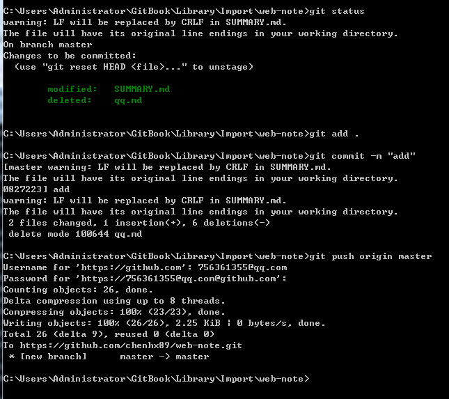

1.https://www.gitbook.com/editor/windows 到这个网址下载GitBook Editor安装 
2.打开GitBook Editor可创建或导入项目 
3.选择File-->Preferences-->GIT  关联自己的github账号保存 
4.在自己的github上新建项目，复制项目HTTPS地址到 GitBook Editor-->Repository Settings... 
5.cd到本地电脑项目文件夹
6.
