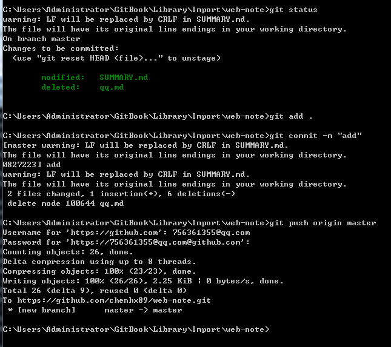

### GitBook Editor 安装

1.https://www.gitbook.com/editor/windows 到这个网址下载GitBook Editor安装 
2.打开GitBook Editor可创建或导入项目 
3.选择File-->Preferences-->GIT  关联自己的github账号保存 
4.在自己的github上新建项目，复制项目HTTPS地址到 GitBook Editor-->Repository Settings... 
5.cd到本地电脑项目文件夹 

### 将项目搭建服务器，生成html文件

1.在安装了nodejs的前提下安装gitbook,命令语句：npm install -g gitbook-cli 
2.输入命令：gitbook -V 查看gitbook是否安装成功 
3.cd到对应项目，初始化目录文件，命令语句：gitbook init 
4.命令语句：gitbook build 
5.命令语句：gitbook serve  开启服务器
